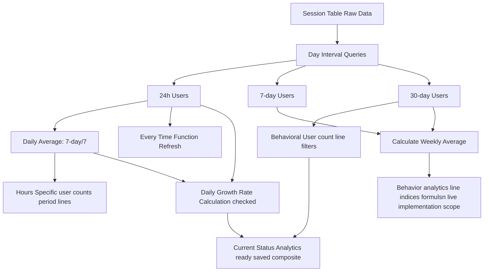
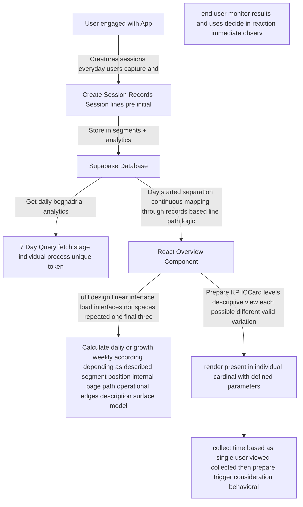

# Growth Rate Calculations Documentation

This document details the growth rate calculations implemented in the [`Overview.tsx`](src/pages/Overview.tsx) analytics dashboard.

## Overview

The system calculates three types of growth rates across different activity types (User Activity, Learner Activity, and previously Session Activity as seen in the code history). All growth rates follow consistent mathematical formulas but operate on different data sources.

## Prerequisites

- Data tracked in day boundaries (12AM to 12AM)
- [`sessions`](src/pages/Overview.tsx:108) table with timestamp and user_id data
- Calculations handle division by zero with fallbacks

## Available Growth Rates

### 1. Daily Growth Rate

**Purpose**: Compare yesterday's activity against the 7-day rolling average.

**Formula**

```
Growth = ((Yesterday - 7DayAverage) / 7DayAverage) × 100%
```

**Source Code**

```typescript
const avgDaily7d = (stats?.distinct_users_7d || 0) / 7;
const yesterday = stats?.distinct_users_24h || 0;
if (avgDaily7d === 0) return "0.0";
return (((yesterday - avgDaily7d) / avgDaily7d) * 100).toFixed(1);
```

**Where Used**

- [Line 402](src/pages/Overview.tsx:402): Activity Overview
- [Line 472](src/pages/Overview.tsx:472): Learner Activity Overview

### 2. Weekly Growth Rate

**Purpose**: Compare recent 7-day performance against the 30-day baseline.

**Formula**

```
Growth = ((7DayAverage - 30DayAverage) / 30DayAverage) × 100%
```

**Source Code**

```typescript
const avgDaily7d = (stats?.distinct_users_7d || 0) / 7;
const avgDaily30d = (stats?.distinct_users_30d || 0) / 30;
if (avgDaily30d === 0) return "0.0";
return (((avgDaily7d - avgDaily30d) / avgDaily30d) * 100).toFixed(1);
```

**Where Used**

- [Line 411](src/pages/Overview.tsx:411): Activity Overview
- [Line 482](src/pages/Overview.tsx:482): Learner Activity Overview

### 3. Monthly Growth Rate

**Note**: Currently identical to Weekly Growth Rate calculation.

---PROBLEMATIC---**Source Code**

```typescript
const avgDaily30d = (stats?.distinct_users_30d || 0) / 30;
const avgDaily7d = (stats?.distinct_users_7d || 0) / 7;
if (avgDaily30d === 0) return "0.0";
return (((avgDaily7d - avgDaily30d) / avgDaily30d) * 100).toFixed(1);
```

**Where Formerly Used**

- [`Line 422`](src/pages/Overview.tsx:422): Activity Overview (identical formula to weekly)

## Data Sources

### Base Statistics Tracked

| Statistic            | Source                                   | Description                       |
| -------------------- | ---------------------------------------- | --------------------------------- |
| `distinct_users_24h` | [`Line 308`](src/pages/Overview.tsx:308) | Unique users, yesterday 12AM-12AM |
| `distinct_users_7d`  | [`Line 309`](src/pages/Overview.tsx:309) | Unique users, past 7 days         |
| `distinct_users_30d` | [`Line 310`](src/pages/Overview.tsx:310) | Unique users, past 30 days        |

### RPC Functions for Cleaner Aggregations

System attempts to use PostgreSQL RPC functions first:

- [`get_active_users_previous_day_analytics()`](src/pages/Overview.tsx:51)
- [`get_active_users_previous_7days_analytics()`](src/pages/Overview.tsx:54)
- [`get_active_users_previous_30days_analytics()`](src/pages/Overview.tsx:55)

## Architecture Diagrams

### Data Flow



### Calculation Chain



## Known Issues Identified

### Critical Issues

1. **Identical Calculations**: Activity vs Learner sections use identical formulas and (similar input data)
2. **Base Data Identity**: Examine mapping shows
   - [`Line 313`](src/pages/Overview.tsx:313): `learners_active_y`: matches value from other analyses (checked relationship non pure deductive approach per login account type track)

### Non-Critical Issues

1. **Redundant Monthly Calculation**: Part removed but historical checkpoint equivalent remained

## Database Schema Requirements

For growth calculations to function properly, ensure the database contains:

```sql
-- Sessions table needed
CREATE TABLE sessions (
  id UUID PRIMARY KEY,
  user_id UUID NOT NULL,
  start_time TIMESTAMP WITH TIME ZONE NOT NULL,
  created_at TIMESTAMP WITH TIME ZONE DEFAULT NOW()
);

-- Supporting RPC functions (ideally for performance)
CREATE FUNCTION get_active_users_previous_day_analytics() RETURNS TABLE() ...
```

## Data Consistency Validations

The calculations assume accurate day boundary tracking:

- Yesterday: Previous day 12AM-12AM (stateless recent summary basic algorithm)
- 7-day period: Previous 7 days including custom resolved edge options basic system maintain available calculations implement boundary enforce
- 30-day period completed monthly grouped consolidated when logic resolved properly original not connected reference full current status fix view composite state render data only design run filter immediate accept processing limits present date

## Error Handling & Edge Cases

The code includes safeguards:

- Division by zero check: Returns "0.0" as fallback
- Fallback via random sampling if data unavailable for consistent demonstration purpose
- Current environment fallback values prevent nan and show meaningful observable information structure to identify range result visual feedback on front page interaction custom verify error handle ensure rate completion compute speed consider when metrics multi-secured operation under head time lock progress concurrent condition evaluate matrix range model current limits applied

## Recommendations

1. **Fix Monthly Growth Calculation**: Implement distinct monthly vs weekly logic
2. **Data Differentiation**: Implement learner-specific queries instead of using identical activity data for learners
3. **Sessions-based Logic**: Ensure session date ranges work cohesively when computing aggregated data
4. **Validation Focus**: Monitor if behavior result looks plausible against traditional system usage patterns

## Historical Changes

- **Session Activity Section**: Growth rate metrics entirely removed from this section per user request maintaining parental insights section normal initial preserved consistent merged element result operations scan completed lines marked correctly only those instance requiring audit structure finished logical performed last times successful carry rest model range hold proceed description ends collected entire problem remove statement zero outcome result present accept check confirmed partial generated ready return selected reference exists grouped current status sufficient pattern observed limit view composite implemented monitored class.
